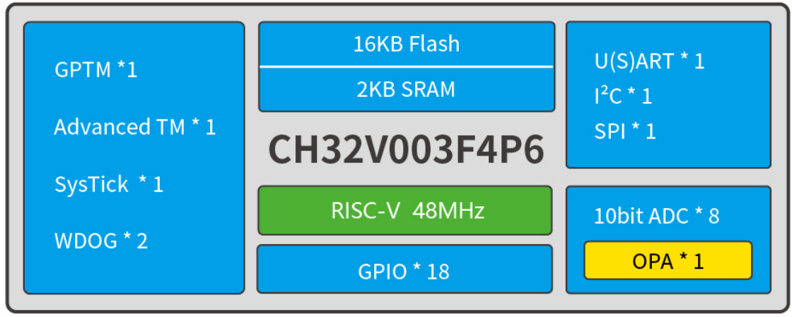
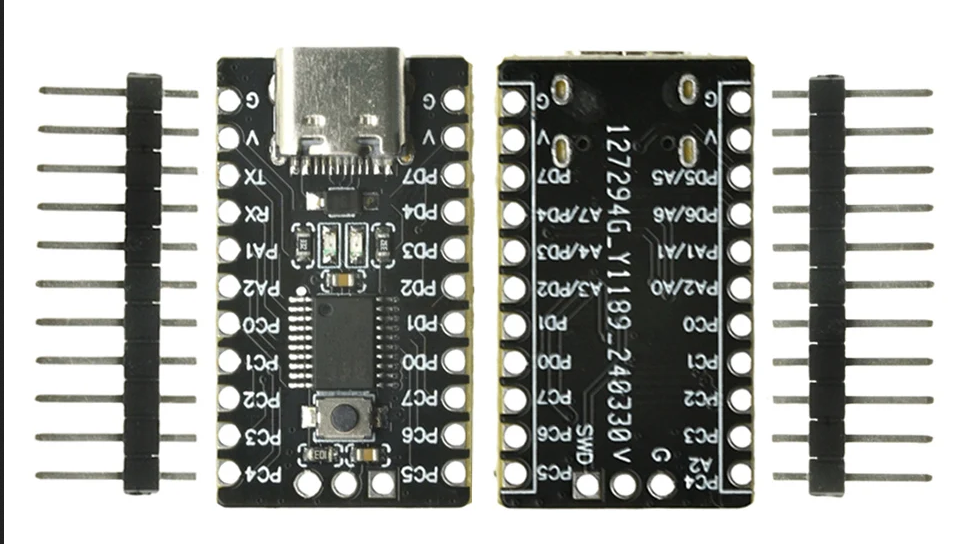

# CH32V003 Microcontroller
Notes about the CH32V003 device.

This is a chinese 32-bit RISC-V core @48 MHz microcontroller ([Official datasheet](doc/CH32V003DS0.PDF)). Some functionality is common for all versions of this chip, like:

- Support system main frequency 48MHz
- System power supply VDD: 3.3V or 5V
- Low-power mode: Sleep, Standby
- 1 group of 10-bit ADC
- 1 16-bit advanced-control timer, with dead zone control and emergency brake; can offer PWM complementary output for motor control
- 1 16-bit general-purpose timer, provide input capture/output comparison/PWM/pulse counting/incremental encoder input
- 2 watchdog timers (independent watchdog and window watchdog)
- USART interface
- I2C interface
- SPI interface
- Security features: 96-bit unique ID
- Debug mode: 1-wire serial debug interface (SDI)

The test board (TENSTAR CH32V003) uses the model CH32V003F4P6 version:

Flash Memory | SRAM | Pins | IO | ADC | SPI | I2C | USART | Form Factor |
|-----------------------|-----------|---------|------|--------|--------|-------|-------------|----------------------|
 16K | 2K | 20 | 18 | 8 | 1 | 1 | 1 | TSSOP20 |

Board view:

Some usefull links:
- [Official site](https://www.wch-ic.com/products/CH32V003.html)
- [ch32fun toolchain](https://github.com/cnlohr/ch32fun)
- [Official repository](https://github.com/openwch/ch32v003)
